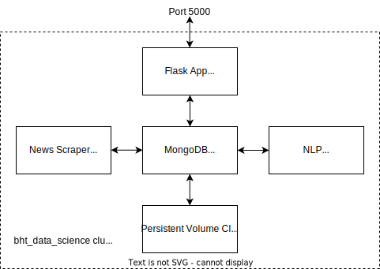

# dsWorkflowProj

This project realizes a simple and basic newsreader app utilizing a microservices architecture.
The news outlets BBC, CNN, and Foxnews are scraped for articles, which are stored into a MongoDB.
On said articles two nlp tasks are performed (classification into news categories and named entity recognition).
Users can access and browse the processed articles through a web app.  

In general this project is meant to gain first experiences and familiarize with the infrastructure aspects of ds workflows and applications, especially working with a kubernetes cluster, overcoming issues such as working with a purely remote deployed system, different debugging strategies, etc... 
 

## Basic Structure
  

The app is realized on a kubernetes cluster and consists of 3 microservices and a database:
- MongoDB (`mongodb/`)
  -  Managed by a deployment
  -  Attached service
  -  Data is stored via persistent volume claim.
-  News Scraper (`gatherer/`)
   -  Scrapes BBC, CNN, and, Foxnews via module Newspaper3k
   -  Cronjob runs each hour
   -  Stores articles in the db via pymongo
   -  Checks if article associated url exists in db, if not article is downloaded and added to db (prevent redundant scraping/downloads/db writes)
   -  15 k articles have been scraped within 14 days, after minimal cleaning 10 k articles remain
-  NLP (`nlp/`)
   -  Gets articles from the db, processes these and writes them back to the db
   -  Only processes new articles of course
   -  Named entity recognition
      -  Performed on article title
      -  Off the shelf BERT model
         - Already fine tuned for NER
         - https://huggingface.co/dslim/bert-base-NER
   -  Articles Classification
      -  Performed on article text
      -  Off the self BART model
         -  Already fine tuned for article classification
         -  https://huggingface.co/Softechlb/articles_classification
   -  Utilizes only CPU (does not hog GPU)
   -  Overall inference time per article approx 1.5 s
   -  Cronjob runs each 3 hours
   -  Processing only performed if there are more than 10 new articles
   -  Extensive logging (useful when processing thousands of articles)
-  Flask App (`flask_app/`)
   -  UI for browsing and filtering processed articles
   -  very rudimentary
   -  `templates/index.html` completely created by chatgpt
   -  Accessed by port forwarding (listens on port 5000)

## Result
- Success, app works and runs continuously without crashing for two weeks
- 15 k articles have been scraped within 14 days, after minimal cleaning 10 k articles remain
- Sampling processed articles by hand suggests NER and classification work in an adequate manner

## Ideas/discussion/issues
- improve web app, provide simple download dataset function
- think about batch processing for parallel processing, batch processing gpu usage...
- "back to the roots", keep it simple, working with old python versions, no type hinting...
- postprocessing unique named entities etc...
- Encoding issues had to be fixed (Encoding issue: cannot encode object: 0.78782666, of type: <class 'numpy.float32'>)
- use tqdm...
- UnicodeEncodeError: 'ascii' codec can't encode character '\u2019' in position 58: ordinal not in range(128)
- Suddenly no more print and logs displayed in pod logs (solution set ENV PYTHONUNBUFFERED=1)